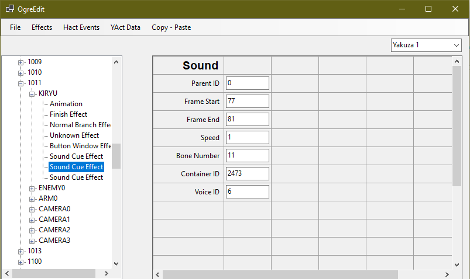
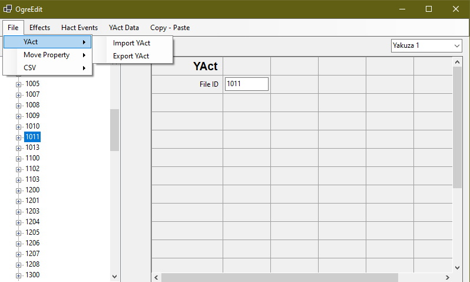
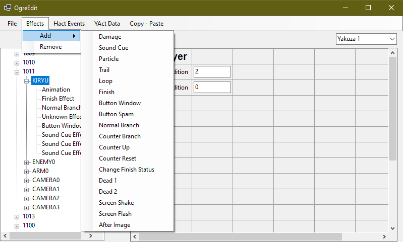

## OgreEdit  
A Yakuza 1 and 2 Heat Action (YAct) Editor Capable Of:
  
* Creating Yakuza 1 and 2 Heat actions
  
* Editing CSV (YActPlayData) files

(Horrible code btw)

## Credits

Thanks to:  

* [Jhrino](https://github.com/Fronkln) for helping with the YAct and CSV formats  

## Usage:  

## Yakuza 1:

* Import a CSV

* Highlight the desired YAct

* Import the YAct bin

* Edit, and add Effects(By highlighting a character/camera and then adding an effect)

* Highlight the YAct

* Export

## Yakuza 2:

* Import a YAct

* Edit, and add Effects(By highlighting a character/camera and then adding an effect)

* Edit, and add HActEvents(Every name must be unique for each HActEvent)

* Select the YAct

* Export

* Import CSV

* Edit the HActEvents accordingly (Names must match inside YAct and CSV)

* Export CSV
